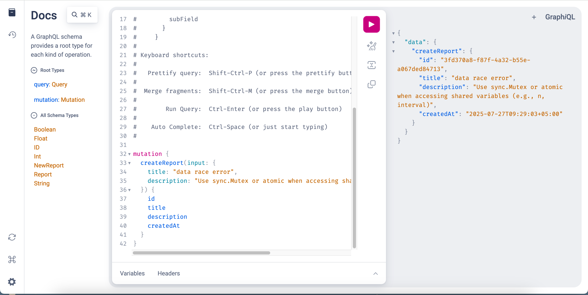
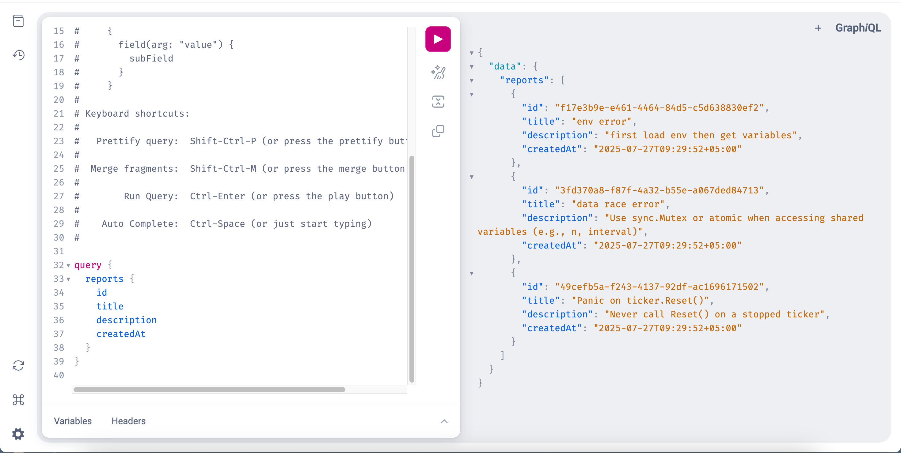

# BugHub (Go + GraphQL + MongoDB)

A small bug report system built in 1 day for learning purposes and to demo GraphQL in Go.

## Tech Stack

- Go
- GraphQL (gqlgen)
- MongoDB

## Screenshots

### Creating a Report



### Fetching Reports



## Getting Started

1. Clone repo
2. Run MongoDB (locally)
3. Add `.env` file:
4. Run go run server.go
```bash
go run server.go
```

Example Queries
See examplequery.txt for ready-to-use GraphQL queries:

**Mutation**:
```
mutation {
  createReport(title: "env error", description: "first load env then get variables") {
    id
    title
  }
}
```
**Query**:
```
query {
  reports {
    id
    title
    description
    createdAt
  }
}
```